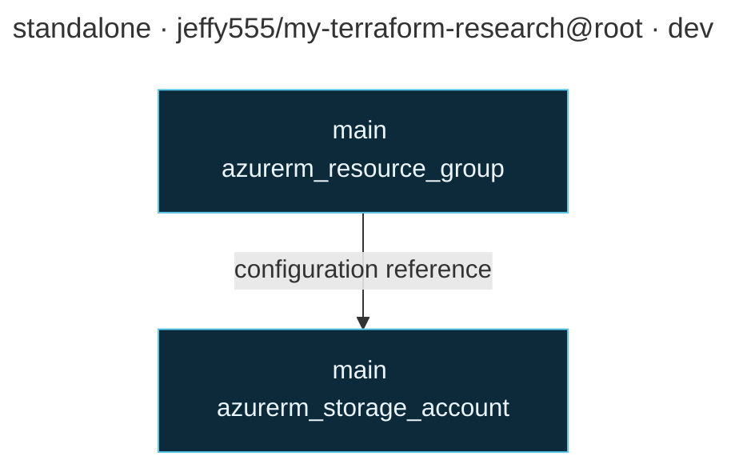

# Terraform architecture

This diagram is generated from the Terraform configuration selected in SpiritOps. Edit the Mermaid source below directly when needed, or regenerate it after configuration changes. It describes configuration intent, not deployed state or a Terraform plan.

